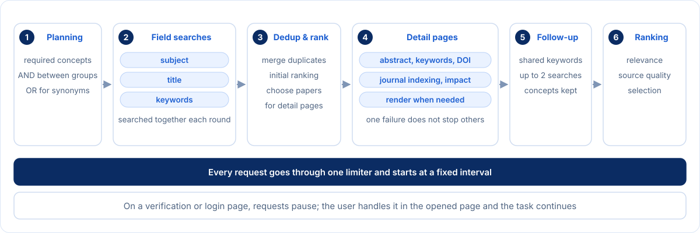
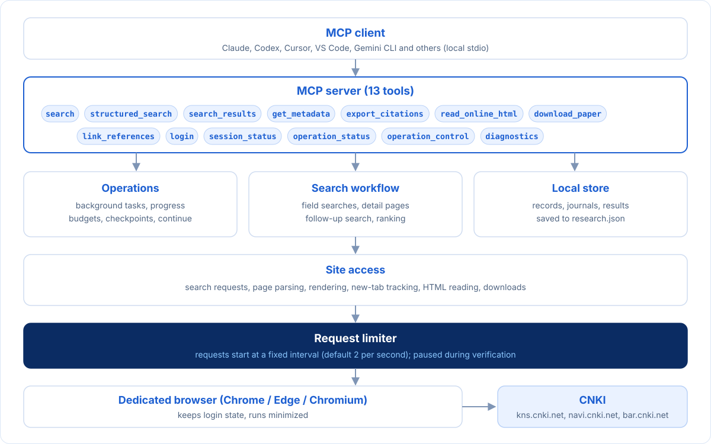
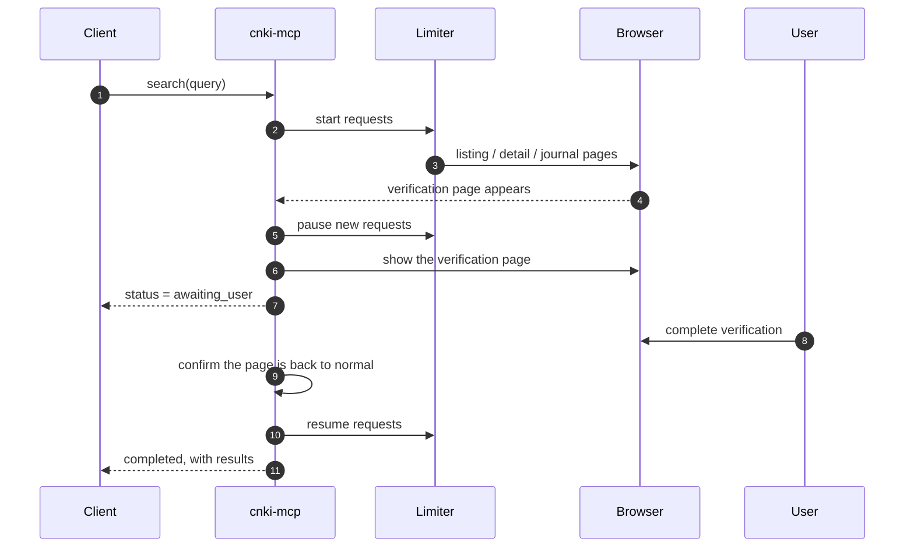

<div align="center">


[](CHANGELOG.md)
[](go.mod)
[](https://modelcontextprotocol.io)
[](#tools)
[](#quick-start)
[](LICENSE)

[简体中文](README.md) · English

[Quick start](#quick-start) · [Examples](#examples) · [Tools](#tools) · [Search workflow](#search-workflow) · [Architecture](#architecture) · [Configuration](#configuration) · [Troubleshooting](#troubleshooting)

</div>

---

CNKI Research MCP is a local [MCP](https://modelcontextprotocol.io) server for CNKI (China National Knowledge Infrastructure). Once connected to a client such as Claude, Codex or Cursor, it lets you search CNKI in natural language, retrieve bibliographic records and journal information, read HTML full text, download PDF/CAJ files and export references.

The server accesses CNKI through a dedicated local browser and uses your own personal or institutional login. Credentials are entered only in the browser and never pass through MCP. When CNKI shows a verification or login page, that page is opened for you to handle, and the task continues afterwards.

## Features

- Research search: plans search concepts from a research question, searches the subject, title and keyword fields, removes duplicates, reads detail and journal pages, runs follow-up searches on keywords shared by relevant papers, and ranks results by relevance and source quality.
- Advanced search: 16 CNKI search fields with AND / OR / NOT, year limits, and sorting by relevance, publication date, citations or downloads.
- Bibliographic records: authors, affiliations, source, volume/issue/pages, DOI, abstract, keywords and funding, plus journal indexing (CSSCI, PKU Core, AMI and others) and impact factors.
- Full text: reads HTML full text by section or page; results state when CNKI only offers a preview.
- Downloads: downloads PDF or CAJ files and verifies them before saving; a download is never clicked again automatically when the previous result is unclear.
- Citations: 13 formats including GB/T 7714, APA, MLA, Chicago, Vancouver, BibTeX, RIS, EndNote and CSL-JSON, and adds CNKI links to titles quoted in a text.
- Operations: longer tasks run in the background and can be monitored, cancelled or continued after an interruption.

## Quick start

### 1. Download

Download the archive for your platform from [Releases](../../releases) and extract it to a permanent folder:

| System | Package | Setup |
| --- | --- | --- |
| macOS (Apple silicon) | `macOS-arm64` | double-click `安装设置.command` |
| macOS (Intel) | `macOS-x64` | double-click `安装设置.command` |
| Windows 64-bit | `Windows-x64` | double-click `安装设置.cmd` |
| Linux | `Linux-x64` / `Linux-arm64` | run `./安装设置.sh` |

Chrome, Edge or Chromium must be installed; logging in and verification require a desktop session. The program is a single executable and does not need Python or Node.js.

### 2. Run setup

The setup program:

1. selects a browser on your computer;
2. selects the client to connect and writes its configuration (the original file is backed up first);
3. checks that the MCP server starts correctly.

Available clients:

| Option | Client | Configuration |
| --- | --- | --- |
| `claude-desktop` | Claude Desktop | written automatically |
| `claude-code` | Claude Code | written automatically |
| `codex` | Codex | written automatically |
| `cursor` | Cursor | written automatically |
| `gemini` | Gemini CLI | written automatically |
| `dsh-desktop` | DeepSeek Harness desktop | written automatically (run the client once first) |
| `dsh-web` | DeepSeek Harness web (`dsh web`) | written automatically (run the client once first) |
| `workbuddy` | WorkBuddy | written automatically |
| `zcode` | ZCode | written automatically |
| `kimi-code` | Kimi Code (CLI and desktop) | written automatically |
| `codebuddy` | CodeBuddy CLI | written automatically |
| `qwen-code` | Qwen Code | written automatically |
| `qoder-cli` | Qoder CLI | written automatically |
| `qoder` | Qoder IDE | one-click import link |
| `trae` | Trae | one-click import link |
| `chatbox` | Chatbox | one-click import link |
| `cherry-studio` | Cherry Studio | one-click import link |
| `trae-cn` | Trae CN | paste into settings |
| `lingma` | Tongyi Lingma | paste into settings |
| `codebuddy-ide` | CodeBuddy IDE | paste into settings |
| `comate` | Baidu Comate | paste into settings |
| `vscode` | VS Code / GitHub Copilot | paste into settings |
| `windsurf` | Windsurf | paste into settings |
| `cline` | Cline | paste into settings |
| `roo` | Roo Code | paste into settings |
| `lobehub` | LobeHub / LobeChat | paste into settings |
| `generic` | Any other stdio client | paste into settings (generic JSON) |

The three methods:

- Written automatically: merged into the client's configuration file, keeping all other settings and backing up the original first. DeepSeek Harness creates its configuration folder on first run, so open the desktop app or `dsh web` once beforehand.
- One-click import link: `setup` generates the client's import link and offers to open it; the client asks you to confirm.
- Paste into settings: `setup` prints the snippet and says where to paste it. These clients manage their configuration through their own interface, or do not document where the file is, so it is not written directly.

Snippets are also saved in the data folder as `cnki-<option>.json` (`.toml` for Codex, `.yaml` for DeepSeek Harness), can be printed at any time with `cnki-mcp config <option>`, and `cnki-mcp help` lists every option.

You can also run it in one command:

```sh
./cnki-mcp setup --browser "/Applications/Google Chrome.app/Contents/MacOS/Google Chrome" --client claude-desktop --install-client
```

### 3. Restart the client and log in

Restart the client so it loads the `cnki` server, then ask it to log in, for example "Log me in to CNKI". Complete the personal or institutional login in the browser window that opens. The login state is kept in the dedicated browser profile, so you do not need to log in again next time.

## Examples

Ask in the client and it will choose the tools:

| Request | Tools used |
| --- | --- |
| Research how courts handle liquidated damages in non-compete agreements, and summarize the debates and recent changes | `search`, `search_results`, `get_metadata` |
| Find papers by 王利明 since 2020 with “违约金” in the title, newest first | `structured_search` |
| What are the abstracts and keywords of these three papers, and are their journals in CSSCI? | `get_metadata` |
| Read the second part of the first paper | `read_online_html` |
| Export the results as GB/T 7714 and as a BibTeX file | `export_citations` |
| Download the PDF of 《再论违约金调整》 | `download_paper` |
| Add CNKI links to the paper titles in this paragraph | `link_references` |

## Tools

There are 13 tools. Some clients add a prefix to tool names (for example `mcp__cnki__search`). The complete parameter definitions are in [`docs/tool-schema.json`](docs/tool-schema.json), exported from the server with `cnki-mcp schema`.

| Tool | Description | Accesses CNKI |
| --- | --- | :---: |
| [`search`](#search) | Research search: planning, field searches, detail and journal pages, follow-up searches, ranking | yes |
| [`structured_search`](#structured_search) | Search with CNKI fields and boolean conditions | yes |
| [`search_results`](#search_results) | Page through saved search results | no |
| [`get_metadata`](#get_metadata) | Retrieve records and journal information in batches | yes |
| [`read_online_html`](#read_online_html) | Read HTML full text | yes |
| [`download_paper`](#download_paper) | Download PDF/CAJ | yes |
| [`export_citations`](#export_citations) | Export references | depends |
| [`link_references`](#link_references) | Add links to titles in a text | depends |
| [`login`](#login) | Open a browser window to log in | yes |
| [`session_status`](#session_status) | Show login state | depends |
| [`operation_status`](#operation_status) | Check progress and results | no |
| [`operation_control`](#operation_control) | Cancel or continue tasks, show the window again, restart the browser | no |
| [`diagnostics`](#diagnostics) | Local diagnostics | no |

### Common conventions

- Operation records. Every tool that accesses CNKI runs as an operation. The call waits up to about 40 seconds (`CNKI_INLINE_WAIT_SECONDS`) and then returns an operation record:

  ```json
  {
    "operation_id": "op_…",
    "kind": "search",
    "status": "completed",
    "stage": "enrichment",
    "progress": {"done": 39, "total": 80},
    "requests": 128,
    "active_seconds": 68.1,
    "budget": {"max_requests": 600, "timeout_seconds": 900},
    "result": {},
    "errors": []
  }
  ```

  `result` holds the tool's own result, which is what "Returns" means for each tool below. While `status` is `running`, keep waiting with `operation_status`.
- Manual steps. When the operation needs a verification or login, the status becomes `awaiting_user`, `message` explains what to do, and the browser window is brought to the front. Once you finish in the window, the operation continues by itself. No new requests are sent in the meantime.
- Partial results. `partial` means there is a result but some papers or steps failed. Each entry in `errors` has a `code` and `message`, plus the affected `record_ref`, `title` and stage (`detail`, `journal` or `locate`).
- Errors. Invalid parameters or operations that cannot run return `isError=true` with `{"status": "failed", "errors": [{"code": "…", "message": "…"}]}`. Common codes are listed under [Troubleshooting](#troubleshooting).
- Record references. A `record_ref` (for example `rec_8f6f38fc3ab3f5b8e4637434`) is a local record identifier. It stays the same when the same paper appears again.

### search

Runs a complete research search from a question.

Steps:

1. Plan the search concepts. `concept_groups` is used when given. Otherwise the client's model plans them if the client supports MCP sampling; if not, the query is split at explicit separators (spaces, commas, enumeration commas), and common spellings are added for version identifiers such as Wi-Fi and IEEE 802.11.
2. Search the subject, title and keyword fields with the same concepts, one page per field per round. The search stops after a round once `candidate_target` is reached or `max_pages` pages have been read.
3. Merge duplicates, rank the candidates and choose which detail pages to read. The rules are described in [Search workflow](#search-workflow).
4. Read detail pages and journal pages.
5. Among the top 10 relevant papers, find keywords shared by at least 2 papers, run up to 2 follow-up searches, and read detail pages for the new papers. This step is skipped for `mode=precise` or `metadata=basic`.
6. Score relevance and source quality, rank, and select up to 100 papers.

| Parameter | Type | Default | Description |
| --- | --- | --- | --- |
| `query` | string | required | Research question or search terms, 1–1000 characters |
| `concept_groups` | string[][] | planned | Concept groups: AND between groups, OR between synonyms in a group; up to 8 groups of 1–6 terms, each term up to 80 characters |
| `mode` | enum | `balanced` | `precise` skips follow-up searches; `balanced` and `broad` currently behave the same |
| `limit` | int | 50 | Number of results returned (1–100); affects only the returned list, not searching, detail pages or selection |
| `year_from` / `year_to` | int | none | Publication year range, inclusive; applied both as a search condition and as a filter |
| `options.candidate_target` | int | 300 | Target number of candidates (1–3000) |
| `options.max_pages` | int | 5 | Maximum pages per field (1–100) |
| `options.metadata` | enum | `ranked` | `ranked`: read detail pages for a subset chosen by initial ranking; `all`: read all; `basic`: listing data only, no detail pages and no follow-up searches |
| `options.freshness` | enum | `prefer_cache` | `prefer_cache`: a completed search with the same parameters within 10 minutes is returned without accessing CNKI; `live`: search again |
| `options.sort` | enum | `relevance` | CNKI listing order: `relevance`, `date_desc`, `cited_desc`, `downloaded_desc` |
| `options.max_requests` | int | 600 | Request limit (1–5000) |
| `options.timeout_seconds` | int | 900 | Running time limit (1–7200 seconds); time waiting for the user is not counted |
| `options.on_verification` | enum | `ask` | `ask`: open the window and wait; `skip`: skip resources that need manual verification |

Example:

```json
{
  "query": "初中物理分层作业的研究进展",
  "concept_groups": [["初中物理"], ["分层作业", "作业分层"]],
  "year_from": 2020,
  "limit": 20
}
```

Returns (`result`):

```json
{
  "search_id": "op_78e6712b2389370dba3a5718",
  "status": "completed",
  "candidate_count": 340,
  "eligible_count": 91,
  "selected_count": 4,
  "enhanced_count": 76,
  "quality_source_count": 21,
  "selection_exclusions": {"insufficient_relevance_evidence": 249, "ranking_or_quality_threshold": 87},
  "coverage": [{"channel": "q1", "pages": 4, "rows": 200, "total": 513, "exhausted": false}],
  "plan": {"concepts": [["竞业限制"], ["违约金"]], "channels": [], "method": "lexical"},
  "results": [{"record_ref": "rec_…", "title": "整体主义视野下离职竞业限制违约金的法律治理", "url": "https://kns.cnki.net/kcms2/article/abstract?v=…"}]
}
```

| Field | Meaning |
| --- | --- |
| `search_id` | Search identifier for `search_results`, `get_metadata` and `export_citations` |
| `candidate_count` | Total candidates |
| `eligible_count` | Papers that pass the relevance threshold |
| `selected_count` | Selected papers |
| `enhanced_count` | Papers with an abstract read from the detail page |
| `quality_source_count` | Journals with indexing or impact factor information |
| `selection_exclusions` | Why papers were not selected: insufficient relevance, or below the ranking/quality threshold |
| `coverage` | Per search (`q1` subject, `q2` title, `q3` keywords, `feedback1/2` follow-up): pages, rows, total and whether all pages were read |
| `plan` | Concept groups and conditions used; `method` is `explicit`, `sampling` or `lexical` |
| `results` | The first `limit` selected papers |

<details>
<summary>Scoring and selection</summary>

- Relevance = (0.32 × title match + 0.28 × abstract match + 0.12 × keyword match + 0.20 × cross-field rank score + 0.08 × fields hit / 3 + 0.12 × concept coverage) / 1.12. Text matching uses the overlap of Chinese character pairs and English words.
- Relevant papers: relevance ≥ 0.25 and at least half of the required concepts covered.
- Source quality = 0.45 × indexing level + 0.25 × impact factor + 0.20 × citations per year + 0.10 × document type. Indexing level: SCI/SSCI/A&HCI 1.0, CSSCI 0.96, PKU Core and CSCD 0.94, EI 0.90, AMI Core 0.88.
- Score = relevance × (0.35 + 0.65 × source quality) + 0.20 × source quality.
- Selection: only relevant papers whose score is at least max(0.24, top score × 0.55), and that also meet one of these conditions: full concept coverage, high source quality, or relevance ≥ 0.55 when no quality information exists.

</details>

Notes:

- Results are saved only when the search finishes or stops; `search_results` cannot read a search that is still running.
- When the budget runs out the status is `partial`. Use `operation_control` with `continue`; work already done is not requested again.
- A year range filters out listing rows without a year.

### structured_search

Corresponds to CNKI advanced search. Use it for precise restrictions on author, source, DOI, funding and similar fields.

`expression` is a condition tree:

- A single condition: `{"field": "title", "value": "违约金", "match": "phrase"}`
- A combination: `{"op": "and" | "or" | "not", "items": [...]}`

The tree is expanded into the form CNKI supports, an OR of AND groups, and `not` becomes an "exclude" condition on its field.

| Parameter | Type | Default | Description |
| --- | --- | --- | --- |
| `expression` | object | required | Search conditions |
| `sort` | enum | `relevance` | `relevance`, `date_desc`, `cited_desc`, `downloaded_desc` |
| `limit` | int | 50 | Number of results (1–100); unless `options.candidate_target` is set, it also determines how many rows are fetched, usually one page |
| `year_from` / `year_to` | int | none | Year range |
| `options` | object | — | Same as `search`; defaults to `metadata=basic` (listing data only); set `ranked` or `all` to read detail pages |

Fields:

| Field | CNKI field | Field | CNKI field |
| --- | --- | --- | --- |
| `subject` | Subject | `title` | Title |
| `keywords` | Keywords | `abstract` | Abstract |
| `title_keywords_abstract` | Title, keywords and abstract | `fulltext` | Full text |
| `authors` | Author | `first_author` | First author |
| `corresponding_author` | Corresponding author | `institutions` | Affiliation |
| `source` | Source | `doi` | DOI |
| `funds` | Funding | `references` | References |
| `classification` | Classification code | `subtitle` | Subheading |

Limits:

- `match` is `phrase` (fuzzy, default) or `exact`; `subject` does not support `exact`.
- `and` and `or` take 2–12 items; `not` takes exactly 1.
- The tree may have up to 96 nodes and 8 levels, and expand to at most 32 groups.
- Every expanded group needs at least one positive condition, so "A or not B" on its own cannot be searched.
- Terms with spaces or special characters are quoted automatically; terms containing both single and double quotes are not supported.

Example:

```json
{
  "expression": {"op": "and", "items": [
    {"field": "title", "value": "违约金"},
    {"field": "authors", "value": "王利明"},
    {"op": "not", "items": [{"field": "keywords", "value": "定金"}]}
  ]},
  "year_from": 2020,
  "sort": "date_desc",
  "limit": 20
}
```

The result has the same format as `search`. CNKI's order is kept (no relevance re-ranking), and the selection is the first 100 rows.

### search_results

Reads saved search results without accessing CNKI. Any page and scope can be read.

| Parameter | Default | Description |
| --- | --- | --- |
| `search_id` | required | From `search` or `structured_search` |
| `scope` | `selected` | `selected`: selected results; `eligible`: all relevant papers; `candidates`: all candidates |
| `view` | `titles` | Level of detail, see below |
| `offset` / `limit` | 0 / 50 | Paging; `limit` is 1–100 |

| `view` | Each result contains |
| --- | --- |
| `titles` | `record_ref`, `title`, `url` |
| `compact` | The above plus `authors`, `year`, `source`, `abstract`, `score`, `eligible` |
| `records` | The full `record`, `score`, `eligible`, and the scoring details `evidence` (match scores, indexing level, impact factor and so on) |

Returns `search_id`, `status`, `scope`, `total` (total rows in the scope), `offset`, `next_offset` (`null` on the last page) and `results`.

Record fields reflect the latest data: if an abstract was added later with `get_metadata`, it appears here.

### get_metadata

Retrieves bibliographic records in batches.

Papers can come from any combination of:

- `record_refs`: record references;
- `titles`: exact titles. A unique local match is used first; the remaining titles are searched on CNKI by exact title, 10 titles per search;
- `search_id`: the results of a search, with `scope` (default `selected`), `offset` and `limit` (default 50).

Each paper's detail page is read once; pages read within the last 30 days are not requested again. With `quality=true`, the journal page is also read for indexing and impact factors. Each journal is read once and kept for 7 days.

| Parameter | Description |
| --- | --- |
| `record_refs` / `titles` / `search_id` | Up to 100 papers per call |
| `scope` / `offset` / `limit` | Used with `search_id` |
| `fields` | Return only these fields; `record_ref` and `title` are always included |
| `quality` | `true` to retrieve journal information; also enabled when `fields` contains `quality` |
| `refresh` | Read detail pages again even if read within 30 days |
| `local_only` | Return local data only, without accessing CNKI; titles must have a unique local match |

Returns, for each entry of `result.records`:

| Field | Description |
| --- | --- |
| `record_ref`, `title`, `authors`, `institutions` | Reference, title, authors, affiliations |
| `source`, `year`, `publication_date`, `volume`, `issue`, `pages` | Source and publication data; dates confirmed on the detail page take precedence over listing dates |
| `document_type` | Document type, such as journal article, master's or doctoral thesis, conference paper, newspaper |
| `doi`, `dbcode`, `dbname`, `filename` | Identifiers |
| `abstract`, `keywords`, `funds` | Abstract, keywords, funding; for documents that only have a text snippet (such as newspapers), it is in `excerpt` |
| `cited`, `downloaded` | Citation and download counts (from the listing) |
| `url`, `source_url` | Paper page and journal page links |
| `quality` | Journal information: `canonical_title` (current journal name), `identity_basis` (matched by current, translated or former title), `tiers` (indexing, for example `["CSSCI", "AMI核心"]`), `tier_evidence` (the page text behind each tier), `composite_impact` / `aggregate_impact` (impact factors), `metric_year`, `state` |
| `detail_observed_at` | When the detail page was read |

```json
{
  "record_ref": "rec_98ec26524d0701b569fa7f8c",
  "title": "过分高于损失:违约金调整的基本标准——以民法典第585条第2款为中心",
  "authors": ["王利明"],
  "source": "法学研究",
  "year": 2024,
  "keywords": ["违约金", "损失", "违约金调减", "意思自治", "违约金功能"],
  "quality": {"canonical_title": "法学研究", "identity_basis": "current_title", "tiers": ["AMI顶级", "CSSCI"], "composite_impact": 16.135, "metric_year": 2025, "state": "present"}
}
```

A failure on one paper does not affect the others; the reason is recorded in `errors`. Common reasons:

- `DOCUMENT_NOT_FOUND`: the exact title does not exist on CNKI;
- `IDENTITY_AMBIGUOUS`: several papers share the title;
- `SOURCE_IDENTITY_UNCONFIRMED`: the journal page name does not match the paper's source;
- `PARSER_UNSUPPORTED`: unsupported page layout, for example books.

### read_online_html

Reads a paper's HTML full text.

Steps:

1. Open the detail page and check that title and authors match.
2. Wait for the page scripts to load, then click "HTML阅读" or "在线阅读".
3. Wait up to 20 seconds for the reader, in the same tab or a tab CNKI opens. Verifications such as "slide to continue reading" are handed to you.
4. Extract the text and sections. If the page's table of contents lists sections that have not loaded yet, keep waiting.

The text is kept locally for 30 minutes (up to 16 papers). During that time, paging or switching sections for the same paper is served locally. Preview-only or incomplete text is not kept, so the next call reads it again.

| Parameter | Description |
| --- | --- |
| `record_ref` / `title` | One of the two; `title` must be the exact title |
| `section` | Return one section (with its subsections); names come from `sections` in the result, case and extra spaces are ignored |
| `offset` / `max_characters` | Paging by characters, 20,000 per call by default, at most 200,000 |
| `on_verification` | `ask` (default) or `skip` |

Returns:

| Field | Description |
| --- | --- |
| `text` | The text for this page; paragraphs are separated by blank lines |
| `sections` | Section list: `level`, `title`, `offset` (start position), `length` |
| `offset`, `next_offset` | Position of this page and the start of the next; `next_offset` is `null` at the end |
| `total_characters` | Total characters of the article (or of the chosen section) |
| `trial` | `true` when CNKI only provides a preview, usually the abstract and notes |
| `coverage` | `container` (element holding the text), `dom_characters` and `extracted_characters` (characters on the page and extracted), `missing_catalog_headings` (sections listed in the table of contents but missing from the text), `non_text_elements` (images, formulas and so on), `scope` (`unknown`, `partial`, `trial`) |
| `complete_article` | `false` when the text is known to be incomplete (preview or missing sections); `null` when completeness cannot be confirmed, which does not mean it is incomplete |

Notes:

- Content in images, formulas and canvas elements cannot be extracted as text.
- If the detail page has no HTML reading link, the tool returns `HTML_ENTRY_NOT_FOUND`; try `download_paper` instead.

### download_paper

Downloads the paper file. Use it only when you need the file.

Steps:

1. Check local records. A previously downloaded, unchanged file is returned directly; if an earlier download's result was unclear, first check whether that file has arrived.
2. Open the detail page, check that title and authors match, and wait for the page scripts to load.
3. Choose the format: with `auto`, PDF if available, otherwise CAJ.
4. Record the download, then click the download link once.
5. Follow the pages CNKI opens for the download:
   - a verification or login page is handed to you, and the tool keeps waiting for the same download;
   - a notice such as no permission or insufficient balance returns `DOWNLOAD_REFUSED` immediately, with the original text.
6. When the download finishes, check the file: a PDF must start with `%PDF-` and contain an end marker, and a CAJ file's header is checked. The SHA-256 is computed and the file is saved to `data/downloads/`.

| Parameter | Description |
| --- | --- |
| `record_ref` / `title` | One of the two |
| `format` | `auto` (default), `pdf`, `caj` |
| `filename` | File name; the extension must match the format. Default: "title_first 8 characters of the reference.pdf" |
| `subdirectory` | Subfolder under `data/downloads/` |
| `wait_seconds` | Time to wait for the download after the click (1–900 seconds, default 120); time spent on verification is not counted |
| `retry` | `true` confirms another click when the previous result is unclear |
| `on_verification` | `ask` (default) or `skip` |

Returns:

```json
{
  "state": "completed",
  "record_ref": "rec_8f6f38fc3ab3f5b8e4637434",
  "format": "pdf",
  "path": "/Users/you/cnki-mcp/data/downloads/再论违约金调整——以《民法典》第585条第2款和第3款为中心_8f6f38fc.pdf",
  "bytes": 1541524,
  "sha256": "860dfe5a…",
  "source": "download"
}
```

`source` is `download` for a new download and `cache` for a file downloaded earlier.

Notes:

- If a file with the same name exists, the tool returns `FILE_EXISTS` and does not overwrite it.
- A timeout returns `SIDE_EFFECT_UNCERTAIN`. The download may still be in progress; calling again later with the same parameters first checks whether the file has arrived. Pass `retry=true` only when you are sure another download is needed.
- Whether a paper can be downloaded depends on your account; personal accounts may be charged.

### export_citations

Produces references or exports bibliographic data.

| Parameter | Description |
| --- | --- |
| `record_refs` / `titles` / `search_id` | Papers to export. `search_id` exports the selected results by default; `scope` can change this to `eligible` or `candidates`. With `titles`, CNKI is accessed to locate the papers and read their detail pages |
| `format` | See below; default `gbt7714` |
| `template` | Template for `format=custom` |
| `filename` | Save to `data/exports/`; existing files are never overwritten |

| `format` | Output |
| --- | --- |
| `gbt7714` | GB/T 7714 numbered references, with type codes such as J, D, C, N, M |
| `apa`, `mla`, `chicago`, `vancouver` | The corresponding styles |
| `bibtex` | `@article`, `@phdthesis`, `@mastersthesis`, `@inproceedings` and other entries, with special characters escaped |
| `ris`, `endnote` | For import into Zotero, EndNote, NoteExpress and similar tools |
| `csl_json` | CSL-JSON |
| `json` | Full records |
| `csv` | Title, authors, source, year, volume, issue, pages, DOI, link; cells starting with `=`, `+`, `-` or `@` are prefixed so spreadsheets do not treat them as formulas |
| `markdown` | A list of linked titles |
| `custom` | Output from a template |

Placeholders for `custom` templates: `{title}`, `{authors}`, `{source}`, `{journal}`, `{year}`, `{volume}`, `{issue}`, `{pages}`, `{doi}`, `{url}`, `{record_ref}`, `{type}`. Write `{{` and `}}` for literal braces. Example: `{authors}. {title}[J]. {journal}, {year}, {volume}({issue}): {pages}.`

Returns `data` with:

- `format`;
- `count`;
- `text` (the export; above 512 KB it can only be saved to a file);
- `path` (when saved to a file);
- `missing_fields`: papers missing authors, source or year, listed by `record_ref`. Missing values appear in the text as placeholders such as "[作者未取得]" (author not available).

### link_references

Replaces 《paper titles》 in a text with Markdown links to CNKI.

Rules:

- Nested title marks are supported: 《论〈民法典〉中的违约金》 is treated as one title.
- Existing Markdown links and code (inside backticks) are left unchanged.
- Only local records are used by default. With `lookup_missing=true`, titles without a local record are searched on CNKI by exact title, 10 per search.
- The text may be up to 512 KB with up to 100 titles.

| Parameter | Description |
| --- | --- |
| `text` | Required; the text containing 《titles》 |
| `lookup_missing` | Look up titles that have no local record on CNKI |

Returns:

- `text`: the text with links;
- `references`: the outcome and matching `record_refs` for each title. `status` is one of:

| `status` | Meaning |
| --- | --- |
| `linked` | Link added |
| `matched_without_link` | Record found but no public link available |
| `ambiguous` | Several papers share the title; no link added |
| `unresolved` | Not found |

### login

Opens the CNKI login page in the dedicated browser for you to log in. Personal accounts, institutional IP access, institutional accounts and institutional remote access (CARSI, WebVPN and others) are supported.

Steps:

1. Open the CNKI advanced search page (or `remote_access_url`). With the default entry, first check whether you are already logged in; if so and `force` is not set, return immediately.
2. Bring the window to the front; the status becomes `awaiting_user`.
3. Every 1.5 seconds, check all open CNKI pages; a recognized personal or institutional identity completes the login. You can also end the wait with `operation_control` and `resume`. The wait lasts at most 20 minutes.
4. Reload the search page to confirm the identity, then minimize the window.

| Parameter | Description |
| --- | --- |
| `remote_access_url` | Institutional remote access entry, an HTTPS address without credentials; after logging in this way you usually need to call `operation_control` with `resume` |
| `force` | Open the login window even if already logged in, for example to switch accounts |

Returns:

```json
{
  "personal": "not_observed",
  "institution": "observed",
  "institution_evidence": ["华东政法大学"],
  "permission_scope": "unknown",
  "evidence_source": "kns_header",
  "observed_at": "2026-10-02T12:42:28Z"
}
```

`personal` is `authenticated` or `not_observed`; `institution` is `observed` or `not_observed`. `permission_scope` is always `unknown`, because a login state does not tell which papers are accessible.

### session_status

Shows the login state.

- Default (`refresh=false`): returns the most recent result observed while the server has been running, with `cached: true`, without accessing CNKI. If nothing has been checked yet, it returns `evidence_source: "not_checked"`.
- `refresh=true`: opens a CNKI page in the background and checks again; the fields are the same as for `login`.

An institution name being shown does not mean the institution subscribes to every resource.

### operation_status

Checks an operation.

| Parameter | Description |
| --- | --- |
| `operation_id` | When omitted, returns the operation currently running, or `{"status": "idle"}` |
| `wait_seconds` | Maximum seconds to wait (0–55). Returns earlier when the operation finishes or starts needing the user; if it is already `awaiting_user`, it waits until you finish or the time is up, so the client does not have to poll repeatedly |

| `status` | Meaning |
| --- | --- |
| `running` | Running; `stage` and `progress` show the current stage and progress |
| `awaiting_user` | Waiting for you in the browser; `message` explains why |
| `completed` | Finished |
| `partial` | Has a result, but some steps failed or the budget ran out; see `errors` |
| `failed` | Failed without a result |
| `skipped` | Skipped because of `on_verification=skip` |
| `cancelled` | Cancelled |
| `interrupted` | The server process stopped while the operation was running; searches can be continued |

The last 200 operations are kept locally and can be queried after a restart.

### operation_control

| `action` | Effect |
| --- | --- |
| `cancel` | Cancel the operation, wait up to 5 seconds for it to stop, and return the final state |
| `continue` | Continue a search that was interrupted, failed or ran out of budget. `additional_requests` and `additional_seconds` raise the budget; if neither is given and the budget is used up, 200 requests or 300 seconds are added. Listings, detail pages and journal information already retrieved are not requested again |
| `resume` | Report that a manual step is finished. Verifications and normal logins are detected automatically; this is usually only needed after an institutional remote login |
| `show` | Bring the window waiting for the user to the front again; `operation_id` may be given |
| `recover` | Close the browser and start it again on the next request, for a crash or lost connection (`BROWSER_UNAVAILABLE`); the login state is stored in the browser profile and is not affected |

Only search operations (`search`, `structured_search`) can be continued. For other operations, call the original tool again. Downloads are never repeated.

### diagnostics

Local check; does not start the browser or access CNKI.

Returns:

- version, Go runtime and platform;
- whether a browser is configured, the data folder, process ID and memory use;
- the current request interval, concurrency limit and in-call wait time;
- once data has been loaded, also:
  - local data counts: papers, journals, searches, operations, downloads;
  - browser state;
  - the operation currently running.

### Resources and prompts

- Resource `cnki://guide`: usage notes for the tools, the same as the server's `instructions`.
- Prompts `research_topic` and `literature_review`, each taking a `topic` argument.
- [`skills/cnki-deep-research`](skills/cnki-deep-research/SKILL.md): a companion research workflow that can be placed in the client's skills folder. It covers search steps, evidence levels (A full text read, B abstract and metadata, C title only) and report structure.

## Search workflow



1. Planning: identifies the required concepts and their synonyms. The query is split only at explicit separators, never inside continuous Chinese words or version identifiers such as `Wi-Fi 8` or `IEEE 802.11bn`. If the client supports sampling, the client's model does the planning.
2. Field searches: the subject, title and keyword fields are searched together. The request format is taken from a real search performed on the CNKI page. The candidate count is checked only after every field has finished the current round.
3. Deduplication and initial ranking: duplicate records are merged by CNKI identifier, DOI or full bibliographic data (papers with the same title but different authors stay separate). After an initial ranking, a subset is chosen for detail pages: all candidates up to 30, 40 up to 100, 60 up to 300, and 80 beyond that.
4. Detail pages: retrieves abstract, keywords, DOI, affiliations and funding, and reads the journal page for indexing and impact factors. Each journal is read once, and its identity is checked against the current, translated and former titles. A failure on one paper does not affect the others.
5. Follow-up searches: keywords shared by top-ranked relevant papers produce up to two additional searches (all original concepts are kept), and detail pages are read for the new papers.
6. Ranking and selection: relevance (title, abstract and keyword match, hits across fields, concept coverage) and source quality (indexing level, impact factor, citations per year, document type) are scored separately. Source quality only reorders relevant papers.

## Architecture



Technology:

- Language: Go 1.27, compiled to a single executable.
- MCP: the official Go SDK [modelcontextprotocol/go-sdk](https://github.com/modelcontextprotocol/go-sdk), over stdio.
- Browser control: [go-rod](https://github.com/go-rod/rod), which drives the local Chrome, Edge or Chromium directly through the Chrome DevTools Protocol (CDP). Playwright is not used, and neither Node.js nor a separately downloaded browser is required.
- Page parsing: [goquery](https://github.com/PuerkitoBio/goquery).

| Module | Files | Responsibility |
| --- | --- | --- |
| MCP server | `server.go` | Tool registration, parameter definitions, resources and prompts |
| Tool handlers | `app.go`, `documents.go`, `download.go`, `links.go`, `citations.go` | Validation, title lookup, text cache, download records, citation formats |
| Operations | `jobs.go` | Background tasks, progress, budgets, checkpoints |
| Search workflow | `research.go`, `rank.go`, `query.go` | Search rounds, detail pages, follow-up searches, ranking; planning and condition compilation |
| Site access | `site.go`, `parse.go` | Search requests, page parsing, rendering, new-tab tracking, manual verification |
| Request limiter | `limiter.go` | Request interval and concurrency; pauses requests during verification |
| Browser | `browser.go` | Dedicated browser, in-page requests, resource loading, clicks |
| Local store | `store.go`, `lock_*.go` | In-memory data written to a file periodically; data folder lock |

### Manual verification



### Design notes

- Every request to CNKI goes through the same limiter: it is counted against the task budget and then started at a fixed interval.
- Stages wait for each other only where data depends on it: detail pages are chosen after the listing results, and follow-up searches start after detail pages are read.
- Detail pages (within 30 days) and journal information (within 7 days) are not requested again, so continuing an interrupted task only requests missing data.
- The request format, page selectors and verification detection are based on observation of the actual CNKI pages.
- Listing data never overwrites values confirmed on a detail page; conflicting identities are reported as errors rather than merged.

## Configuration

The following environment variables can be set in the `env` section of the client's MCP configuration:

| Variable | Default | Description |
| --- | --- | --- |
| `CNKI_DATA_DIR` | `data/` next to the program | Data folder |
| `CNKI_BROWSER_PATH` | from `config.json` | Browser executable path |
| `CNKI_REQUEST_INTERVAL_MS` | 500 | Interval between requests in milliseconds; increase it if verification pages appear often |
| `CNKI_MAX_INFLIGHT` | 6 | Maximum concurrent requests |
| `CNKI_WORKERS` | 8 | Concurrent detail page readers |
| `CNKI_INLINE_WAIT_SECONDS` | 40 | Time a tool call waits for the result before returning an `operation_id` |

## Data and privacy

```text
data/
├── config.json      browser settings
├── research.json    records, journal information, search results, tasks and downloads
├── browser/         dedicated browser profile (including login state)
├── downloads/       downloaded papers
└── exports/         exported references
```

- Credentials are entered only in the browser window and never pass through MCP.
- Web pages and paper content are treated as data, never as instructions to the AI.
- A data folder can be used by only one server process at a time.

## Troubleshooting

| Symptom | Action |
| --- | --- |
| Unsure whether the server works | Run `cnki-mcp doctor --protocol` |
| Status `awaiting_user` | Complete the verification or login in the opened window; if it is hidden, call `operation_control` with `show` |
| Logged in but shown as logged out | Call `session_status(refresh=true)`; after an institutional remote login, call `operation_control` with `resume` |
| `BROWSER_UNAVAILABLE` | Call `operation_control` with `recover`, then retry or `continue` |
| `BUDGET_EXHAUSTED` or `interrupted` | Call `operation_control` with `continue`, optionally with `additional_requests` |
| `DATA_DIRECTORY_IN_USE` | Another server process is using the same data folder |
| `IDENTITY_AMBIGUOUS` | Several papers share the title; choose a `record_ref` by author, year and source |
| `SIDE_EFFECT_UNCERTAIN` | The previous download result is unclear; calling again checks for existing files first, pass `retry=true` to download again |
| `DOWNLOAD_REFUSED` | CNKI returned a refusal (no permission, not subscribed, login required); the original text is included |
| `trial` is `true` in reading results | The account only has preview access; try `download_paper` |
| Verification pages appear often | Increase `CNKI_REQUEST_INTERVAL_MS` or decrease `CNKI_MAX_INFLIGHT` |

## Development

```sh
go test -race ./...
go vet ./...
go build ./cmd/cnki-mcp

# Tests with a real browser against simulated CNKI pages (does not access CNKI)
CNKI_TEST_BROWSER=/path/to/chrome go test ./internal/cnki/ -run SiteAgainstLocalKNS
```

| Command | Purpose |
| --- | --- |
| `cnki-mcp serve` | Start the MCP server (default) |
| `cnki-mcp setup` | Browser and client setup |
| `cnki-mcp config <client>` | Print the configuration for a client |
| `cnki-mcp schema` | Export the tool definitions |
| `cnki-mcp doctor [--protocol]` | Local check; `--protocol` also checks MCP communication |

<details>
<summary>Manual configuration example</summary>

```json
{
  "mcpServers": {
    "cnki": {
      "command": "/full/path/cnki-mcp",
      "args": ["serve"],
      "env": { "CNKI_DATA_DIR": "/full/path/data" }
    }
  }
}
```

</details>

Project layout:

```text
cmd/cnki-mcp/     command-line entry point
internal/cnki/    server implementation and tests
docs/             design notes, tool definitions, validation records, images
skills/           companion research workflow
scripts/          packaging, build and image generation scripts
```

See also the [design notes](docs/DESIGN.md), [validation records](docs/VALIDATION.md) and [changelog](CHANGELOG.md) (in Chinese).

## License

Released under [GPL-3.0-or-later](LICENSE). Licenses of dependencies are listed in [THIRD_PARTY_NOTICES.md](THIRD_PARTY_NOTICES.md). This project is not an official CNKI product; it works with the user's existing account and access rights. Please follow CNKI's terms of use.
