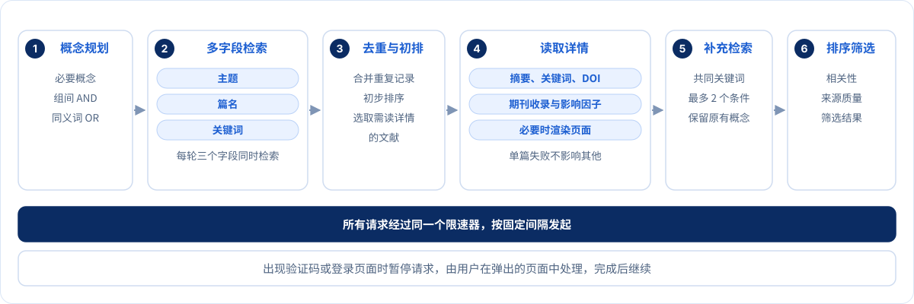
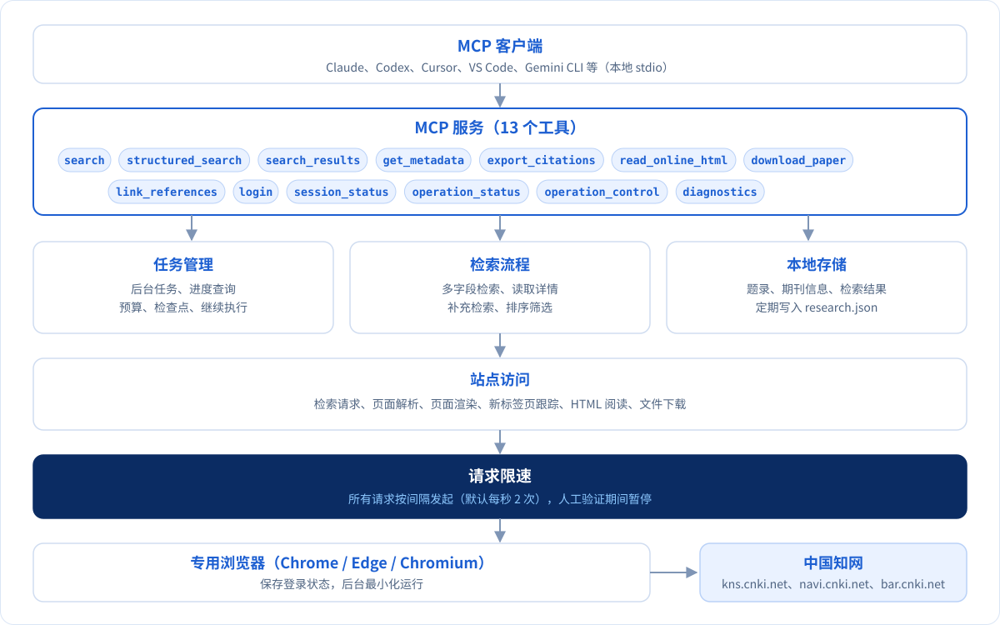
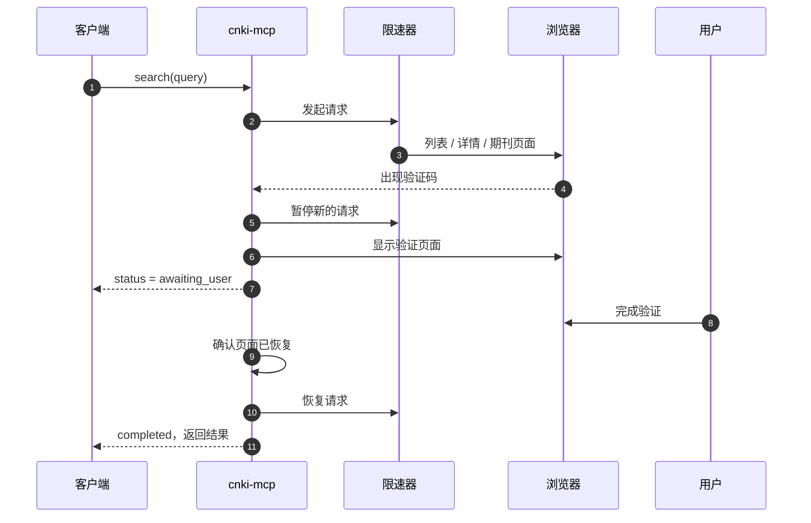

<div align="center">


[](CHANGELOG.md)
[](go.mod)
[](https://modelcontextprotocol.io)
[](#工具说明)
[](#快速开始)
[](LICENSE)

简体中文 · [English](README.en.md)

[快速开始](#快速开始) · [使用示例](#使用示例) · [工具说明](#工具说明) · [检索流程](#检索流程) · [架构](#架构) · [配置](#配置) · [故障排查](#故障排查)

</div>

---

CNKI Research MCP 是一个在本机运行的知网 [MCP](https://modelcontextprotocol.io) 服务。接入 Claude、Codex、Cursor 等客户端后，可以用自然语言检索知网文献、获取题录与期刊来源信息、阅读 HTML 正文、下载 PDF/CAJ，并导出参考文献。

服务通过一个专用的本地浏览器访问知网，使用你自己的个人或机构登录，账号密码只在浏览器中输入，不经过 MCP。遇到验证码或登录页面时，会弹出原页面由你处理，处理完成后任务继续执行。

## 主要功能

- 研究检索：根据研究问题规划检索概念，在主题、篇名、关键词三个字段检索，去重后读取详情与期刊信息，再根据相关论文的共同关键词补充检索，最后按相关性和来源质量排序。
- 高级检索：支持知网 16 个检索字段与 AND / OR / NOT 组合，可限定年份，按相关度、发表时间、被引次数或下载次数排序。
- 题录获取：批量获取作者、单位、来源、卷期页、DOI、摘要、关键词、基金，以及期刊收录（CSSCI、北大核心、AMI 等）和影响因子。
- 正文阅读：按章节或分页读取 HTML 正文；知网只提供试读时会在结果中注明。
- 论文下载：下载 PDF 或 CAJ，校验文件后保存到本地；结果不明确时不会自动重复点击下载。
- 引文导出：支持 GB/T 7714、APA、MLA、Chicago、Vancouver、BibTeX、RIS、EndNote、CSL-JSON 等 13 种格式，也可为文本中的《题名》添加知网链接。
- 任务管理：较长的任务在后台运行，可以查询进度、取消，或在中断后继续。

## 快速开始

### 1. 下载

从 [Releases](../../releases) 下载对应平台的压缩包，解压到一个固定目录：

| 系统 | 运行包 | 设置方式 |
| --- | --- | --- |
| macOS（Apple 芯片） | `macOS-arm64` | 双击 `安装设置.command` |
| macOS（Intel） | `macOS-x64` | 双击 `安装设置.command` |
| Windows 64 位 | `Windows-x64` | 双击 `安装设置.cmd` |
| Linux | `Linux-x64` / `Linux-arm64` | 运行 `./安装设置.sh` |

运行需要本机已安装 Chrome、Edge 或 Chromium；登录和验证需要图形界面。程序是单个可执行文件，不需要安装 Python 或 Node.js。

### 2. 运行设置

设置程序会依次：

1. 选择本机浏览器；
2. 选择要接入的客户端，并写入配置（会先备份原配置文件）；
3. 检查 MCP 服务能否正常启动。

可选的客户端：

| 选项 | 客户端 | 配置方式 |
| --- | --- | --- |
| `claude-desktop` | Claude 桌面版 | 自动写入 |
| `claude-code` | Claude Code | 自动写入 |
| `codex` | Codex | 自动写入 |
| `cursor` | Cursor | 自动写入 |
| `gemini` | Gemini CLI | 自动写入 |
| `dsh-desktop` | DeepSeek Harness 桌面版 | 自动写入（需先运行过一次） |
| `dsh-web` | DeepSeek Harness 网页版（`dsh web`） | 自动写入（需先运行过一次） |
| `workbuddy` | WorkBuddy | 自动写入 |
| `zcode` | ZCode | 自动写入 |
| `kimi-code` | Kimi Code（CLI 与桌面版） | 自动写入 |
| `codebuddy` | CodeBuddy CLI | 自动写入 |
| `qwen-code` | Qwen Code | 自动写入 |
| `qoder-cli` | Qoder CLI | 自动写入 |
| `qoder` | Qoder IDE | 一键导入链接 |
| `trae` | Trae | 一键导入链接 |
| `chatbox` | Chatbox | 一键导入链接 |
| `cherry-studio` | Cherry Studio | 一键导入链接 |
| `trae-cn` | Trae CN | 粘贴配置 |
| `lingma` | 通义灵码 | 粘贴配置 |
| `codebuddy-ide` | CodeBuddy IDE | 粘贴配置 |
| `comate` | 文心快码 Comate | 粘贴配置 |
| `vscode` | VS Code / GitHub Copilot | 粘贴配置 |
| `windsurf` | Windsurf | 粘贴配置 |
| `cline` | Cline | 粘贴配置 |
| `roo` | Roo Code | 粘贴配置 |
| `lobehub` | LobeHub / LobeChat | 粘贴配置 |
| `generic` | 其他支持 stdio 的客户端 | 粘贴配置（通用 JSON） |

三种配置方式：

- 自动写入：直接合并到客户端的配置文件，保留原有的其他配置，并先备份原文件。DeepSeek Harness 的配置目录在首次运行时才会创建，所以需要先打开过一次对应的桌面版或 `dsh web`。
- 一键导入链接：`setup` 会生成客户端提供的导入链接并询问是否打开，由客户端弹出确认。
- 粘贴配置：`setup` 生成配置片段，并提示在客户端设置中的粘贴位置。这些客户端的配置由其界面管理，或配置文件位置没有公开说明，因此不直接写文件。

配置片段同时保存在数据目录中，文件名为 `cnki-<选项>.json`（Codex 为 `.toml`，DeepSeek Harness 为 `.yaml`）；也可以随时用 `cnki-mcp config <选项>` 输出，用 `cnki-mcp help` 查看全部选项。

也可以直接使用命令行：

```sh
./cnki-mcp setup --browser "/Applications/Google Chrome.app/Contents/MacOS/Google Chrome" --client claude-desktop --install-client
```

### 3. 重启客户端并登录

重启客户端以加载 `cnki` 服务，然后让 AI 执行登录，例如：“帮我登录知网”。在弹出的浏览器窗口中完成个人登录或机构登录即可。登录状态保存在专用浏览器的配置目录中，之后无需重复登录。

## 使用示例

在客户端中直接提问，AI 会选择相应的工具：

| 提问示例 | 使用的工具 |
| --- | --- |
| 研究竞业限制违约金的裁判思路，梳理理论分歧和近年变化 | `search`、`search_results`、`get_metadata` |
| 查找王利明 2020 年以后篇名含“违约金”的论文，按发表时间排序 | `structured_search` |
| 这三篇论文的摘要和关键词是什么，期刊是否为 CSSCI | `get_metadata` |
| 读一下第一篇论文的第二部分 | `read_online_html` |
| 把检索结果导出为 GB/T 7714 格式和 BibTeX 文件 | `export_citations` |
| 下载《再论违约金调整》的 PDF | `download_paper` |
| 为这段文字中的论文题名加上知网链接 | `link_references` |

## 工具说明

共 13 个工具。部分客户端会给工具名加前缀（如 `mcp__cnki__search`）。完整的参数定义见 [`docs/tool-schema.json`](docs/tool-schema.json)，该文件由 `cnki-mcp schema` 从服务导出。

| 工具 | 说明 | 访问知网 |
| --- | --- | :---: |
| [`search`](#search) | 研究检索：规划、多字段检索、详情与期刊信息、补充检索、排序 | 是 |
| [`structured_search`](#structured_search) | 按知网检索字段和布尔条件检索 | 是 |
| [`search_results`](#search_results) | 分页读取已保存的检索结果 | 否 |
| [`get_metadata`](#get_metadata) | 批量获取题录和期刊信息 | 是 |
| [`read_online_html`](#read_online_html) | 读取 HTML 正文 | 是 |
| [`download_paper`](#download_paper) | 下载 PDF/CAJ | 是 |
| [`export_citations`](#export_citations) | 导出参考文献 | 视参数而定 |
| [`link_references`](#link_references) | 为文本中的题名添加链接 | 视参数而定 |
| [`login`](#login) | 打开浏览器窗口登录 | 是 |
| [`session_status`](#session_status) | 查看登录状态 | 视参数而定 |
| [`operation_status`](#operation_status) | 查询任务进度和结果 | 否 |
| [`operation_control`](#operation_control) | 取消、继续任务，重新显示窗口，重启浏览器 | 否 |
| [`diagnostics`](#diagnostics) | 本地诊断 | 否 |

### 通用约定

- 任务返回格式：需要访问知网的工具都以任务方式运行。调用后最多等待约 40 秒（`CNKI_INLINE_WAIT_SECONDS`），然后返回一个任务记录：

  ```json
  {
    "operation_id": "op_…",
    "kind": "search",
    "status": "completed",
    "stage": "enrichment",
    "progress": {"done": 39, "total": 80},
    "requests": 128,
    "active_seconds": 68.1,
    "budget": {"max_requests": 600, "timeout_seconds": 900},
    "result": {},
    "errors": []
  }
  ```

  `result` 是工具本身的结果，下文各工具的“返回”指的就是它。`status` 为 `running` 时用 `operation_status` 继续等待。
- 人工步骤：任务需要验证或登录时，状态变为 `awaiting_user`，`message` 说明要做什么，同时浏览器窗口会切到前台。你在窗口中处理完成后，任务自动继续。此期间所有新请求都会暂停。
- 部分完成：`partial` 表示任务有结果，但部分文献或步骤失败。失败原因写在 `errors` 中，每项包含 `code`、`message`，以及涉及的 `record_ref`、`title` 和阶段（`detail`、`journal`、`locate`）。
- 错误返回：参数错误或无法执行时，工具返回 `isError=true` 和 `{"status": "failed", "errors": [{"code": "…", "message": "…"}]}`。常见错误码见[故障排查](#故障排查)。
- 记录编号：`record_ref`（如 `rec_8f6f38fc3ab3f5b8e4637434`）是本地记录编号。同一篇论文再次出现时，编号保持不变。

### search

根据研究问题完成一次完整检索。

执行步骤：

1. 规划检索概念。优先使用 `concept_groups`；没有提供时，客户端支持 MCP sampling 就请客户端模型规划，否则按空格、顿号、逗号等明确分隔符拆分，并为 Wi-Fi、IEEE 802.11 等版本号补充常见写法。
2. 用同一组概念分别检索主题、篇名、关键词三个字段，每轮三个字段同时翻一页。一轮结束后，候选数达到 `candidate_target` 或翻满 `max_pages` 页就停止。
3. 合并重复记录，初步排序，选出要读取详情的文献，数量规则见[检索流程](#检索流程)。
4. 读取详情页和期刊页。
5. 从排名前 10 的相关文献中，找出至少出现在 2 篇里的共同关键词，最多再检索 2 次，并读取新增文献的详情。`mode=precise` 或 `metadata=basic` 时跳过这一步。
6. 计算相关性与来源质量，排序并筛选，筛选结果最多 100 篇。

| 参数 | 类型 | 默认值 | 说明 |
| --- | --- | --- | --- |
| `query` | string | 必填 | 研究问题或检索词，1–1000 字 |
| `concept_groups` | string[][] | 自动规划 | 检索概念组：组与组之间为 AND，组内同义词为 OR；最多 8 组，每组 1–6 个词，每个词不超过 80 字 |
| `mode` | enum | `balanced` | `precise` 不做补充检索；`balanced` 与 `broad` 目前行为相同 |
| `limit` | int | 50 | 返回的结果条数（1–100），只影响返回列表，不影响检索、读取详情或筛选 |
| `year_from` / `year_to` | int | 不限 | 发表年份范围，含边界；同时作用于检索条件和结果过滤 |
| `options.candidate_target` | int | 300 | 候选文献数量目标（1–3000） |
| `options.max_pages` | int | 5 | 每个字段最多翻页数（1–100） |
| `options.metadata` | enum | `ranked` | `ranked`：按初步排序选取部分文献读取详情；`all`：全部读取；`basic`：只用列表信息，不读详情、不补充检索 |
| `options.freshness` | enum | `prefer_cache` | `prefer_cache`：10 分钟内参数相同且已完成的检索直接返回，不访问知网；`live`：重新检索 |
| `options.sort` | enum | `relevance` | 知网列表排序：`relevance`、`date_desc`、`cited_desc`、`downloaded_desc` |
| `options.max_requests` | int | 600 | 请求数上限（1–5000） |
| `options.timeout_seconds` | int | 900 | 运行时间上限（1–7200 秒），等待人工操作的时间不计入 |
| `options.on_verification` | enum | `ask` | `ask`：弹出窗口等待处理；`skip`：跳过需要人工验证的资源 |

示例：

```json
{
  "query": "初中物理分层作业的研究进展",
  "concept_groups": [["初中物理"], ["分层作业", "作业分层"]],
  "year_from": 2020,
  "limit": 20
}
```

返回（`result`）：

```json
{
  "search_id": "op_78e6712b2389370dba3a5718",
  "status": "completed",
  "candidate_count": 340,
  "eligible_count": 91,
  "selected_count": 4,
  "enhanced_count": 76,
  "quality_source_count": 21,
  "selection_exclusions": {"insufficient_relevance_evidence": 249, "ranking_or_quality_threshold": 87},
  "coverage": [{"channel": "q1", "pages": 4, "rows": 200, "total": 513, "exhausted": false}],
  "plan": {"concepts": [["竞业限制"], ["违约金"]], "channels": [], "method": "lexical"},
  "results": [{"record_ref": "rec_…", "title": "整体主义视野下离职竞业限制违约金的法律治理", "url": "https://kns.cnki.net/kcms2/article/abstract?v=…"}]
}
```

| 字段 | 含义 |
| --- | --- |
| `search_id` | 检索编号，供 `search_results`、`get_metadata`、`export_citations` 使用 |
| `candidate_count` | 候选文献总数 |
| `eligible_count` | 通过相关性门槛的文献数 |
| `selected_count` | 筛选结果数 |
| `enhanced_count` | 已读取到摘要的文献数 |
| `quality_source_count` | 获得收录或影响因子信息的期刊数 |
| `selection_exclusions` | 未入选的原因统计：相关性不足，或低于排序/质量门槛 |
| `coverage` | 每个检索字段（`q1` 主题、`q2` 篇名、`q3` 关键词、`feedback1/2` 补充检索）的页数、行数、总数，以及是否已翻完 |
| `plan` | 实际使用的概念组和检索条件；`method` 为 `explicit`、`sampling` 或 `lexical` |
| `results` | 筛选结果的前 `limit` 条 |

<details>
<summary>评分与筛选规则</summary>

- 相关性 = (0.32 × 标题匹配 + 0.28 × 摘要匹配 + 0.12 × 关键词匹配 + 0.20 × 多字段排名得分 + 0.08 × 命中字段数 / 3 + 0.12 × 概念覆盖) / 1.12。文本匹配基于中文双字和英文词的重合度。
- 相关文献：相关性 ≥ 0.25，且至少覆盖一半的必要概念。
- 来源质量 = 0.45 × 收录级别 + 0.25 × 影响因子 + 0.20 × 年均被引 + 0.10 × 文献类型。收录级别：SCI/SSCI/A&HCI 1.0，CSSCI 0.96，北大核心与 CSCD 0.94，EI 0.90，AMI 核心 0.88。
- 总分 = 相关性 × (0.35 + 0.65 × 来源质量) + 0.20 × 来源质量。
- 筛选：只在相关文献中选取，总分须不低于 max(0.24, 首篇得分 × 0.55)，同时满足概念全覆盖、来源质量较高，或没有质量信息但相关性 ≥ 0.55 等条件之一。

</details>

注意：

- 检索中途不保存结果。任务完成或中断后才能用 `search_results` 读取。
- 预算用完时状态为 `partial`，用 `operation_control` 的 `continue` 继续，已完成的部分不会重复请求。
- 年份范围会过滤掉没有年份信息的列表行。

### structured_search

对应知网的高级检索。适合作者、来源、DOI、基金等需要精确限定的检索。

`expression` 是一个条件树：

- 单个条件：`{"field": "title", "value": "违约金", "match": "phrase"}`
- 组合条件：`{"op": "and" | "or" | "not", "items": [...]}`

执行时，条件会展开为知网支持的“若干组 AND 条件之间取 OR”的形式，`not` 转为对应字段的“不含”条件。

| 参数 | 类型 | 默认值 | 说明 |
| --- | --- | --- | --- |
| `expression` | object | 必填 | 检索条件 |
| `sort` | enum | `relevance` | `relevance`、`date_desc`、`cited_desc`、`downloaded_desc` |
| `limit` | int | 50 | 返回条数（1–100）；未设置 `options.candidate_target` 时，也决定抓取的条数，通常只需 1 页 |
| `year_from` / `year_to` | int | 不限 | 年份范围 |
| `options` | object | — | 同 `search`；默认 `metadata=basic`，只用列表信息，设为 `ranked` 或 `all` 时读取详情 |

可用字段：

| 字段 | 知网字段 | 字段 | 知网字段 |
| --- | --- | --- | --- |
| `subject` | 主题 | `title` | 篇名 |
| `keywords` | 关键词 | `abstract` | 摘要 |
| `title_keywords_abstract` | 篇关摘 | `fulltext` | 全文 |
| `authors` | 作者 | `first_author` | 第一作者 |
| `corresponding_author` | 通讯作者 | `institutions` | 作者单位 |
| `source` | 文献来源 | `doi` | DOI |
| `funds` | 基金 | `references` | 参考文献 |
| `classification` | 分类号 | `subtitle` | 小标题 |

限制：

- `match` 为 `phrase`（模糊，默认）或 `exact`（精确）；`subject` 字段不支持 `exact`。
- `and`、`or` 需要 2–12 个子条件，`not` 只能有 1 个子条件。
- 整个条件树最多 96 个节点、8 层，展开后最多 32 组。
- 展开后的每一组都必须至少有一个肯定条件，例如单独的“A 或 非 B”无法检索。
- 检索词含空格或特殊符号时会自动加引号；同时含单引号和双引号的检索词不支持。

示例：

```json
{
  "expression": {"op": "and", "items": [
    {"field": "title", "value": "违约金"},
    {"field": "authors", "value": "王利明"},
    {"op": "not", "items": [{"field": "keywords", "value": "定金"}]}
  ]},
  "year_from": 2020,
  "sort": "date_desc",
  "limit": 20
}
```

返回格式与 `search` 相同。结果保持知网的排序（不做相关性重排），筛选结果即前 100 条。

### search_results

读取已保存的检索结果，不访问知网，可以任意翻页和切换范围。

| 参数 | 默认值 | 说明 |
| --- | --- | --- |
| `search_id` | 必填 | 来自 `search` 或 `structured_search` |
| `scope` | `selected` | `selected` 筛选结果；`eligible` 全部相关文献；`candidates` 全部候选 |
| `view` | `titles` | 返回内容的详细程度，见下表 |
| `offset` / `limit` | 0 / 50 | 分页，`limit` 为 1–100 |

| `view` | 每条结果包含 |
| --- | --- |
| `titles` | `record_ref`、`title`、`url` |
| `compact` | 以上字段加 `authors`、`year`、`source`、`abstract`、`score`、`eligible` |
| `records` | 完整题录 `record`、`score`、`eligible`，以及评分明细 `evidence`（各项匹配分、收录级别、影响因子等） |

返回：`search_id`、`status`、`scope`、`total`（该范围的总条数）、`offset`、`next_offset`（没有下一页时为 `null`）和 `results`。

题录字段会读取最新数据。例如检索之后又用 `get_metadata` 补充了摘要，这里能看到补充后的内容。

### get_metadata

批量获取题录。

文献来源可以组合使用：

- `record_refs`：记录编号；
- `titles`：完整题名。先在本地查找唯一匹配，找不到的再到知网按篇名精确检索，每 10 个题名合并为一次检索；
- `search_id`：取某次检索的结果，可配合 `scope`（默认 `selected`）、`offset`、`limit`（默认 50）。

每篇文献会读取一次详情页（30 天内读取过的不再请求）。`quality=true` 时，再读取期刊页面获取收录和影响因子；同一期刊只读一次，结果保留 7 天。

| 参数 | 说明 |
| --- | --- |
| `record_refs` / `titles` / `search_id` | 一次最多 100 篇 |
| `scope` / `offset` / `limit` | 配合 `search_id` 使用 |
| `fields` | 只返回指定字段，`record_ref` 和 `title` 总会返回 |
| `quality` | 为 `true` 时获取期刊信息；`fields` 包含 `quality` 时也会获取 |
| `refresh` | 忽略 30 天内的已有详情，重新读取 |
| `local_only` | 只返回本地已有数据，不访问知网；按题名查找时只接受本地唯一匹配 |

返回（`result.records` 中的每一项）：

| 字段 | 说明 |
| --- | --- |
| `record_ref`、`title`、`authors`、`institutions` | 编号、题名、作者、作者单位 |
| `source`、`year`、`publication_date`、`volume`、`issue`、`pages` | 来源与出版信息；详情页确认的日期优先于列表日期 |
| `document_type` | 文献类型，如期刊、硕士、博士、会议、报纸 |
| `doi`、`dbcode`、`dbname`、`filename` | 标识符 |
| `abstract`、`keywords`、`funds` | 摘要、关键词、基金；报纸等只有“正文快照”的文献，内容放在 `excerpt` 中 |
| `cited`、`downloaded` | 被引次数、下载次数（取自检索列表） |
| `url`、`source_url` | 论文页面链接、期刊页面链接 |
| `quality` | 期刊信息：`canonical_title`（期刊现名）、`identity_basis`（按现名、译名还是曾用刊名匹配）、`tiers`（收录，如 `["CSSCI", "AMI核心"]`）、`tier_evidence`（收录信息的页面原文）、`composite_impact` / `aggregate_impact`（复合/综合影响因子）、`metric_year`、`state` |
| `detail_observed_at` | 读取详情页的时间 |

```json
{
  "record_ref": "rec_98ec26524d0701b569fa7f8c",
  "title": "过分高于损失:违约金调整的基本标准——以民法典第585条第2款为中心",
  "authors": ["王利明"],
  "source": "法学研究",
  "year": 2024,
  "keywords": ["违约金", "损失", "违约金调减", "意思自治", "违约金功能"],
  "quality": {"canonical_title": "法学研究", "identity_basis": "current_title", "tiers": ["AMI顶级", "CSSCI"], "composite_impact": 16.135, "metric_year": 2025, "state": "present"}
}
```

失败的文献不影响其他文献，失败原因记录在 `errors` 中。常见原因：

- `DOCUMENT_NOT_FOUND`：知网上没有这个完整题名；
- `IDENTITY_AMBIGUOUS`：同名文献有多篇；
- `SOURCE_IDENTITY_UNCONFIRMED`：期刊页面的名称与论文来源对不上；
- `PARSER_UNSUPPORTED`：页面结构不支持，例如图书。

### read_online_html

读取论文的 HTML 全文。

执行步骤：

1. 打开论文详情页，确认题名、作者一致。
2. 等页面脚本加载完成后，点击“HTML阅读”或“在线阅读”。
3. 在原标签页或知网新打开的标签页中等待阅读页出现，最长 20 秒；遇到“滑动验证，继续阅读全文”等验证时交给你处理。
4. 提取正文与章节。如果页面目录中还有章节没有加载出来，会继续等待。

正文在本地保留 30 分钟（最多 16 篇）。此期间对同一篇论文翻页或切换章节，直接从本地返回。试读或不完整的内容不会保留，下次调用会重新读取。

| 参数 | 说明 |
| --- | --- |
| `record_ref` / `title` | 二选一；`title` 须为完整题名 |
| `section` | 只返回指定章节（含其下级小节），章节名取自返回结果中的 `sections`，忽略大小写和多余空格 |
| `offset` / `max_characters` | 按字符分页，默认每次 20000 字，最大 200000 |
| `on_verification` | `ask`（默认）或 `skip` |

返回：

| 字段 | 说明 |
| --- | --- |
| `text` | 本次返回的正文；段落之间以空行分隔 |
| `sections` | 章节列表：`level`（层级）、`title`、`offset`（起始位置）、`length` |
| `offset`、`next_offset` | 本页位置和下一页起点；`next_offset` 为 `null` 表示已到末尾 |
| `total_characters` | 全文（或所选章节）的总字数 |
| `trial` | 为 `true` 表示知网只提供试读，通常只有摘要和注释 |
| `coverage` | `container`（正文所在元素）、`dom_characters` 与 `extracted_characters`（页面字数与提取字数）、`missing_catalog_headings`（目录中有但正文中没有的章节）、`non_text_elements`（图片、公式等数量）、`scope`（`unknown`、`partial`、`trial`） |
| `complete_article` | 为 `false` 表示确定不完整（试读或缺章）；为 `null` 表示无法确认是否完整，不代表不完整 |

注意：

- 图片、公式和 Canvas 中的内容无法提取为文字。
- 详情页没有“HTML阅读”入口时返回 `HTML_ENTRY_NOT_FOUND`，可以改用 `download_paper`。

### download_paper

下载论文文件。只在你明确需要文件时使用。

执行步骤：

1. 检查本地记录。之前已下载且文件未被改动，直接返回该文件；之前的下载结果不明确，先检查文件是否已经下载完成。
2. 打开论文详情页，确认题名、作者一致，并等待页面脚本加载完成。
3. 确定格式：`auto` 时优先 PDF，没有 PDF 入口则用 CAJ。
4. 记录本次下载操作，然后点击一次下载链接。
5. 跟踪知网打开的下载页面：
   - 出现验证码或登录页面时交给你处理，然后继续等待同一个下载；
   - 页面提示无权限、余额不足等时，立即返回 `DOWNLOAD_REFUSED` 和提示原文。
6. 下载完成后检查文件：PDF 须以 `%PDF-` 开头并有结束标记，CAJ 检查文件头。然后计算 SHA-256，保存到 `data/downloads/`。

| 参数 | 说明 |
| --- | --- |
| `record_ref` / `title` | 二选一 |
| `format` | `auto`（默认）、`pdf`、`caj` |
| `filename` | 文件名，扩展名须与格式一致；默认为“题名_编号前 8 位.pdf” |
| `subdirectory` | `data/downloads/` 下的子目录 |
| `wait_seconds` | 点击后等待下载完成的时间（1–900 秒，默认 120）；处理验证的时间不计入 |
| `retry` | 上一次下载结果不明确时，传 `true` 确认再次点击 |
| `on_verification` | `ask`（默认）或 `skip` |

返回：

```json
{
  "state": "completed",
  "record_ref": "rec_8f6f38fc3ab3f5b8e4637434",
  "format": "pdf",
  "path": "/Users/you/cnki-mcp/data/downloads/再论违约金调整——以《民法典》第585条第2款和第3款为中心_8f6f38fc.pdf",
  "bytes": 1541524,
  "sha256": "860dfe5a…",
  "source": "download"
}
```

`source` 为 `download` 表示本次下载，`cache` 表示之前已下载的文件。

注意：

- 已存在同名文件时返回 `FILE_EXISTS`，不会覆盖。
- 等待超时返回 `SIDE_EFFECT_UNCERTAIN`。此时下载可能仍在进行，稍后用相同参数再调用一次，会先检查文件是否已到；确认需要重新下载时才传 `retry=true`。
- 是否能下载取决于你的账号权限，个人账号可能会产生费用。

### export_citations

生成参考文献，或导出题录数据。

| 参数 | 说明 |
| --- | --- |
| `record_refs` / `titles` / `search_id` | 要导出的文献。`search_id` 默认导出筛选结果，可用 `scope` 改为 `eligible` 或 `candidates`；使用 `titles` 时会访问知网定位并读取详情 |
| `format` | 见下表，默认 `gbt7714` |
| `template` | `format=custom` 时的模板 |
| `filename` | 保存到 `data/exports/`，不覆盖已有文件 |

| `format` | 输出 |
| --- | --- |
| `gbt7714` | GB/T 7714 编号格式，文献类型标识按类型取 J、D、C、N、M 等 |
| `apa`、`mla`、`chicago`、`vancouver` | 对应的著录格式 |
| `bibtex` | `@article`、`@phdthesis`、`@mastersthesis`、`@inproceedings` 等条目，特殊字符已转义 |
| `ris`、`endnote` | 可导入 Zotero、EndNote、NoteExpress 等文献管理软件 |
| `csl_json` | CSL-JSON |
| `json` | 完整题录 |
| `csv` | 题名、作者、来源、年份、卷、期、页、DOI、链接；以 `=`、`+`、`-`、`@` 开头的单元格会加前缀，防止被表格软件当作公式 |
| `markdown` | 带链接的题名列表 |
| `custom` | 按模板输出 |

`custom` 模板可用的占位符：`{title}`、`{authors}`、`{source}`、`{journal}`、`{year}`、`{volume}`、`{issue}`、`{pages}`、`{doi}`、`{url}`、`{record_ref}`、`{type}`。要输出字面的花括号，写成 `{{`、`}}`。例：`{authors}. {title}[J]. {journal}, {year}, {volume}({issue}): {pages}.`

返回：`data` 包含：

- `format`；
- `count`；
- `text`（导出内容，超过 512 KB 时只能保存为文件）；
- `path`（保存文件时）；
- `missing_fields`：缺少作者、来源或年份的文献，按 `record_ref` 列出缺失项。缺失处在文本中显示为“[作者未取得]”等。

### link_references

把文本中的《论文题名》替换为指向知网的 Markdown 链接。

规则：

- 支持嵌套书名号，例如《论〈民法典〉中的违约金》会作为一个整体处理。
- 已有的 Markdown 链接和代码（反引号内）不做改动。
- 默认只使用本地已有记录。`lookup_missing=true` 时，本地没有的题名会到知网按篇名精确查找，每 10 个合并为一次检索。
- 文本最大 512 KB，最多 100 个题名。

| 参数 | 说明 |
| --- | --- |
| `text` | 必填，含《题名》的文本 |
| `lookup_missing` | 是否到知网查找本地没有的题名 |

返回：

- `text`：替换后的文本；
- `references`：逐个题名列出处理结果和对应的 `record_refs`。`status` 的取值：

| `status` | 含义 |
| --- | --- |
| `linked` | 已添加链接 |
| `matched_without_link` | 找到记录但没有可公开的链接 |
| `ambiguous` | 有多篇同名文献，未添加链接 |
| `unresolved` | 没有找到 |

### login

在专用浏览器中打开知网登录页面，由你完成登录。支持个人账号、机构 IP 登录、机构账号和机构远程访问（CARSI、WebVPN 等）。

执行步骤：

1. 打开知网高级检索页（或 `remote_access_url`）。使用默认入口时先检查是否已经登录，已登录且没有设置 `force` 时直接返回。
2. 把窗口切到前台，状态变为 `awaiting_user`。
3. 每 1.5 秒检查一次所有打开的知网页面，识别到个人或机构身份即视为完成。也可以调用 `operation_control` 的 `resume` 手动结束等待，最长等待 20 分钟。
4. 重新加载检索页确认身份，然后最小化窗口。

| 参数 | 说明 |
| --- | --- |
| `remote_access_url` | 机构远程访问入口，须为不含账号信息的 HTTPS 地址；这类入口登录后通常需要调用 `operation_control` 的 `resume` |
| `force` | 已登录时仍打开登录窗口，例如切换账号 |

返回：

```json
{
  "personal": "not_observed",
  "institution": "observed",
  "institution_evidence": ["华东政法大学"],
  "permission_scope": "unknown",
  "evidence_source": "kns_header",
  "observed_at": "2026-10-02T12:42:28Z"
}
```

`personal` 为 `authenticated` 或 `not_observed`，`institution` 为 `observed` 或 `not_observed`。`permission_scope` 始终为 `unknown`：登录状态不能说明具体哪些文献可以访问。

### session_status

查看登录状态。

- 默认（`refresh=false`）：返回本次服务运行期间最近一次识别到的结果，带 `cached: true`，不访问知网；还没检查过时返回 `evidence_source: "not_checked"`。
- `refresh=true`：在后台打开知网页面重新识别，返回字段与 `login` 相同。

显示机构名称不代表该机构订购了所有资源。

### operation_status

查询任务。

| 参数 | 说明 |
| --- | --- |
| `operation_id` | 不填时返回当前正在运行的任务；没有任务时返回 `{"status": "idle"}` |
| `wait_seconds` | 最多等待的秒数（0–55）。任务完成或开始需要人工操作时提前返回；任务已处于 `awaiting_user` 时会一直等到你处理完或超时，避免反复查询 |

| `status` | 含义 |
| --- | --- |
| `running` | 运行中，`stage` 和 `progress` 显示当前阶段与进度 |
| `awaiting_user` | 等待你在浏览器中操作，`message` 说明原因 |
| `completed` | 完成 |
| `partial` | 有结果，但部分步骤失败或预算用完，见 `errors` |
| `failed` | 失败，没有结果 |
| `skipped` | 按 `on_verification=skip` 跳过 |
| `cancelled` | 已取消 |
| `interrupted` | 服务进程在任务运行中退出；检索任务可以继续 |

最近 200 个任务记录会保存在本地，服务重启后仍可查询。

### operation_control

| `action` | 作用 |
| --- | --- |
| `cancel` | 取消任务，最多等待 5 秒让任务结束，返回最终状态 |
| `continue` | 继续一个中断、失败或预算用完的检索任务。可用 `additional_requests`、`additional_seconds` 增加预算；不指定且预算已用完时，自动增加 200 个请求或 300 秒。已获取的列表、详情和期刊信息不会重复请求 |
| `resume` | 告知人工操作已完成。验证码和普通登录会自动识别，一般只有机构远程访问登录需要调用 |
| `show` | 把等待人工操作的窗口重新切到前台，可指定 `operation_id` |
| `recover` | 关闭并在下一次请求时重新启动浏览器，用于浏览器崩溃或连接断开（`BROWSER_UNAVAILABLE`）；登录状态保存在浏览器配置中，不受影响 |

只有检索任务（`search`、`structured_search`）可以 `continue`。其他任务中断后，用原工具重新调用即可。下载任务不会被重复执行。

### diagnostics

本地检查，不启动浏览器，也不访问知网。

返回：

- 版本、Go 运行时、平台；
- 是否已配置浏览器、数据目录、进程编号、内存使用；
- 当前的请求间隔、并发上限和调用内等待时间；
- 数据已加载时，还包括：
  - 本地数据量：论文、期刊、检索、任务、下载记录；
  - 浏览器状态；
  - 当前运行的任务。

### 资源与提示词

- 资源 `cnki://guide`：工具使用说明，内容与服务的 `instructions` 相同。
- 提示词 `research_topic`、`literature_review`：参数为 `topic`。
- [`skills/cnki-deep-research`](skills/cnki-deep-research/SKILL.md)：配套的研究流程说明，可放入客户端的 skills 目录使用，内容包括检索步骤、证据分级（A 已读全文，B 摘要与题录，C 仅有题名）和报告结构。

## 检索流程



1. 概念规划：拆分出必要的检索概念及同义词。只按明确的分隔符拆分，不拆分连续的中文词语或版本号（如 `Wi-Fi 8`、`IEEE 802.11bn`）。客户端支持 sampling 时由客户端模型规划。
2. 多字段检索：主题、篇名、关键词三个字段同时检索。检索请求的格式取自知网页面上的真实检索操作。每一轮所有字段都检索完后，再判断候选数量是否足够。
3. 去重与初步排序：按知网编号、DOI 或完整书目信息合并重复记录（题名相同但作者不同的不会合并），然后初步排序，选取一部分文献读取详情：候选不超过 30 篇时全部读取，不超过 100 篇读取 40 篇，不超过 300 篇读取 60 篇，更多时读取 80 篇。
4. 读取详情：获取摘要、关键词、DOI、单位、基金等，并读取期刊页面的收录情况和影响因子。同一期刊只读取一次，期刊名称按现名、译名和曾用刊名核对。单篇文献读取失败不影响其他文献。
5. 补充检索：从排名靠前的相关文献中提取共同关键词，增加最多 2 个检索条件（保留原有全部概念），并读取新增文献的详情。
6. 排序与筛选：分别计算相关性（标题、摘要、关键词匹配，多字段命中，概念覆盖）和来源质量（收录级别、影响因子、年均被引、文献类型）。来源质量只用于相关文献之间的排序。

## 架构



技术栈：

- 语言：Go 1.27，编译为单个可执行文件。
- MCP：官方 Go SDK [modelcontextprotocol/go-sdk](https://github.com/modelcontextprotocol/go-sdk)，通过 stdio 通信。
- 浏览器控制：[go-rod](https://github.com/go-rod/rod)，通过 Chrome DevTools Protocol（CDP）直接控制本机的 Chrome、Edge 或 Chromium。不使用 Playwright，也不需要 Node.js 或额外下载浏览器。
- 页面解析：[goquery](https://github.com/PuerkitoBio/goquery)。

| 模块 | 文件 | 职责 |
| --- | --- | --- |
| MCP 服务 | `server.go` | 注册工具、参数定义、资源与提示词 |
| 工具实现 | `app.go`、`documents.go`、`download.go`、`links.go`、`citations.go` | 参数校验、题名定位、正文缓存、下载记录、引文格式 |
| 任务管理 | `jobs.go` | 后台任务、进度查询、预算、检查点 |
| 检索流程 | `research.go`、`rank.go`、`query.go` | 检索轮次、详情读取、补充检索、排序；概念规划与条件编译 |
| 站点访问 | `site.go`、`parse.go` | 检索请求、页面解析、页面渲染、新标签页跟踪、人工验证 |
| 请求限速 | `limiter.go` | 控制请求间隔和同时进行的请求数，人工验证期间暂停请求 |
| 浏览器 | `browser.go` | 启动专用浏览器、页面内请求、资源读取、点击操作 |
| 本地存储 | `store.go`、`lock_*.go` | 数据保存在内存中并定期写入文件；数据目录加锁 |

### 人工验证流程



### 设计说明

- 所有对知网的请求都经过同一个限速器，先计入任务预算，再按间隔发起。
- 检索各阶段之间只在存在数据依赖时等待：列表结果出来后才能选取详情，详情读取后才能进行补充检索。
- 已读取的详情（30 天内）和期刊信息（7 天内）不会重复请求，因此任务中断后继续执行只会请求缺少的数据。
- 检索请求格式、页面选择器、验证码识别规则均基于对知网页面的实际观察。
- 列表页的数据不会覆盖详情页已确认的值；文献身份有冲突时报告错误，不自动合并。

## 配置

可以在客户端 MCP 配置的 `env` 中设置以下环境变量：

| 变量 | 默认值 | 说明 |
| --- | --- | --- |
| `CNKI_DATA_DIR` | 程序目录下的 `data/` | 数据目录 |
| `CNKI_BROWSER_PATH` | 取自 `config.json` | 浏览器可执行文件路径 |
| `CNKI_REQUEST_INTERVAL_MS` | 500 | 请求间隔（毫秒），频繁出现验证码时可调大 |
| `CNKI_MAX_INFLIGHT` | 6 | 同时进行的请求数上限 |
| `CNKI_WORKERS` | 8 | 读取详情的并发数 |
| `CNKI_INLINE_WAIT_SECONDS` | 40 | 工具调用内等待结果的时间，超时后返回 `operation_id` |

## 数据与隐私

```text
data/
├── config.json      浏览器设置
├── research.json    题录、期刊信息、检索结果、任务与下载记录
├── browser/         专用浏览器配置（含登录状态）
├── downloads/       下载的论文
└── exports/         导出的参考文献
```

- 账号密码只在浏览器窗口中输入，不经过 MCP。
- 网页和论文内容仅作为数据处理，不会被当作对 AI 的指令。
- 同一个数据目录同一时间只能由一个服务进程使用。

## 故障排查

| 现象 | 处理方法 |
| --- | --- |
| 不确定服务是否正常 | 运行 `cnki-mcp doctor --protocol` |
| 状态为 `awaiting_user` | 在弹出的窗口中完成验证或登录；窗口被遮挡时调用 `operation_control` 的 `show` |
| 已登录但显示未登录 | 调用 `session_status(refresh=true)`；使用机构远程入口登录后调用 `operation_control` 的 `resume` |
| `BROWSER_UNAVAILABLE` | 调用 `operation_control` 的 `recover`，然后重试或 `continue` |
| `BUDGET_EXHAUSTED` 或 `interrupted` | 调用 `operation_control` 的 `continue`，可增加 `additional_requests` |
| `DATA_DIRECTORY_IN_USE` | 另一个服务进程正在使用同一数据目录 |
| `IDENTITY_AMBIGUOUS` | 存在同名文献，请根据作者、年份、来源选择 `record_ref` |
| `SIDE_EFFECT_UNCERTAIN` | 上一次下载结果不明确；再次调用会先检查已有文件，确认需要重新下载时传入 `retry=true` |
| `DOWNLOAD_REFUSED` | 知网返回了拒绝信息（如无权限、未订购、需要登录），原文附在结果中 |
| 正文结果中 `trial` 为 `true` | 当前账号只能试读，可尝试 `download_paper` |
| 频繁出现验证码 | 调大 `CNKI_REQUEST_INTERVAL_MS` 或调小 `CNKI_MAX_INFLIGHT` |

## 开发

```sh
go test -race ./...
go vet ./...
go build ./cmd/cnki-mcp

# 使用真实浏览器和本地模拟的知网页面测试（不访问知网）
CNKI_TEST_BROWSER=/path/to/chrome go test ./internal/cnki/ -run SiteAgainstLocalKNS
```

| 命令 | 用途 |
| --- | --- |
| `cnki-mcp serve` | 启动 MCP 服务（默认） |
| `cnki-mcp setup` | 浏览器与客户端设置 |
| `cnki-mcp config <client>` | 输出指定客户端的配置 |
| `cnki-mcp schema` | 导出工具定义 |
| `cnki-mcp doctor [--protocol]` | 本地检查；加 `--protocol` 时检查 MCP 通信 |

<details>
<summary>手动配置示例</summary>

```json
{
  "mcpServers": {
    "cnki": {
      "command": "/完整路径/cnki-mcp",
      "args": ["serve"],
      "env": { "CNKI_DATA_DIR": "/完整路径/data" }
    }
  }
}
```

</details>

目录结构：

```text
cmd/cnki-mcp/     命令行入口
internal/cnki/    服务实现与测试
docs/             设计说明、工具定义、验证记录、图片
skills/           配套研究流程说明
scripts/          打包、构建与图片生成脚本
```

更多内容见 [设计说明](docs/DESIGN.md)、[验证记录](docs/VALIDATION.md) 和 [更新记录](CHANGELOG.md)。

## 许可证

本项目以 [GPL-3.0-or-later](LICENSE) 许可发布。依赖项许可见 [THIRD_PARTY_NOTICES.md](THIRD_PARTY_NOTICES.md)。本项目不是知网官方产品，依赖用户已有的账号和访问权限运行，请遵守知网的使用条款。
